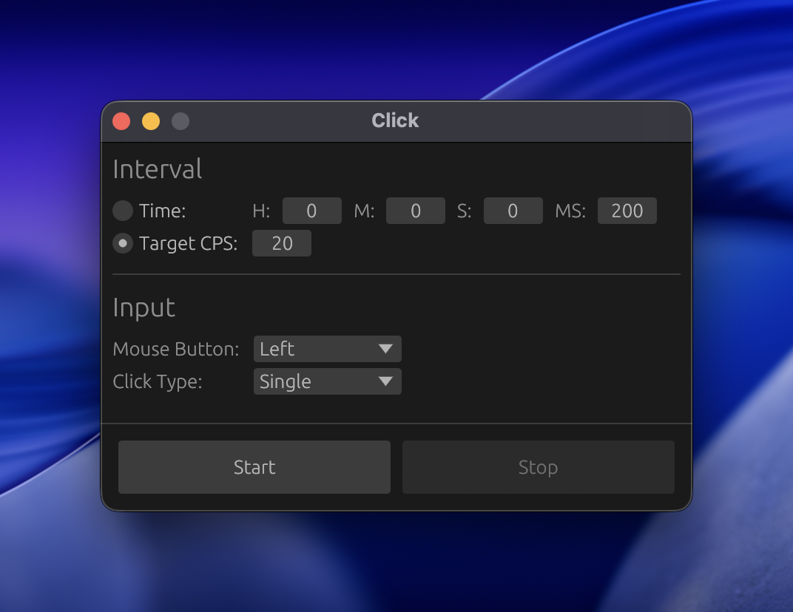

# Click

A fast, cross‑platform autoclicker built with Rust and egui.  
Supports Windows, macOS, and Linux (X11/Wayland).

<p align="center">
  
</p>

---

## Features

- Very fast clicking (~1K CPS)
- Adjustable interval
- Configurable click action (Single / Double)
- Configurable mouse button (Left / Right / Middle)

---

## Installation

You can download the latest release for your platform [here](https://github.com/maskeddd/click/releases).

---

## Building

### Prerequisites

- Install [rustup](https://rustup.rs/)

### Build & Run

```bash
git clone https://github.com/maskeddd/click.git
cd click
cargo build --release
```

The compiled binary will be located at: `./target/release/click`

---

## Roadmap

- [ ] Customizable global hotkey
- [ ] Randomized click interval
- [ ] Clicking a set location
- [ ] Hold clicks

---

## License

Licensed under the [MIT License](./LICENSE).
